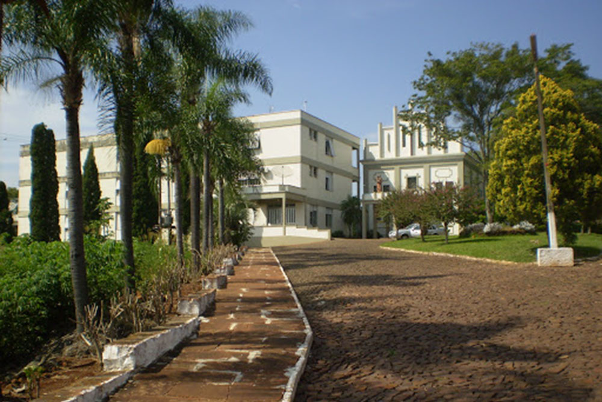
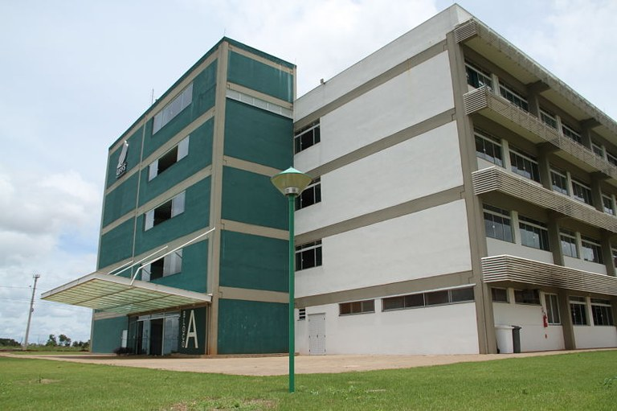
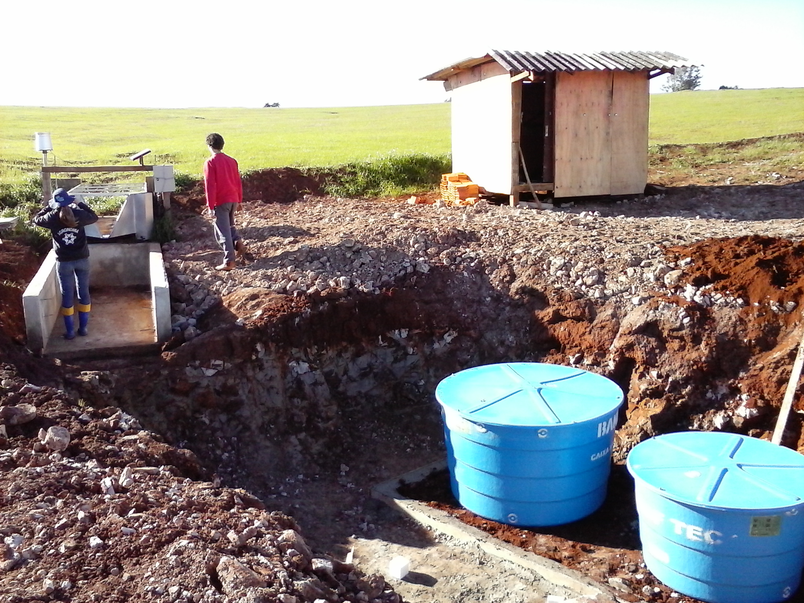
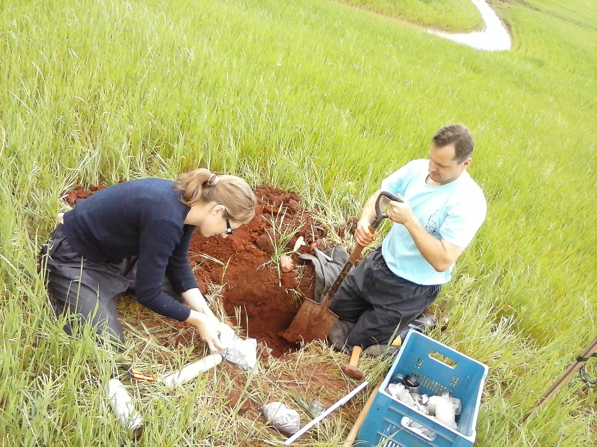
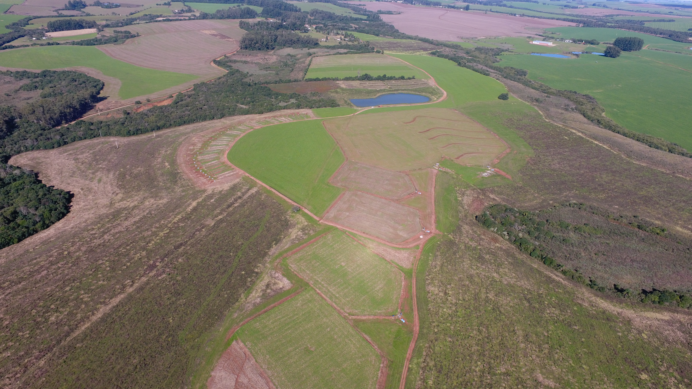
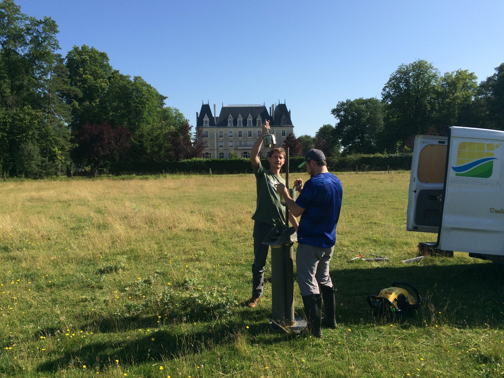
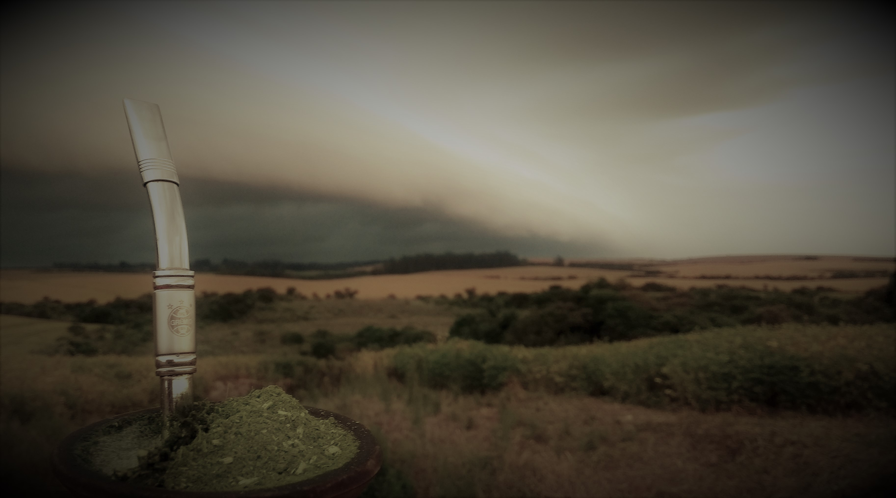

```{r setup, include=FALSE}
options(htmltools.dir.version = FALSE)
knitr::opts_chunk$set(fig.align = "center",
                      message = FALSE,
                      warning = FALSE,
                      echo = FALSE
                      )
```

```{r xaringan-themer, include=FALSE, warning=FALSE}
library(xaringanthemer)
style_mono_accent(
  base_color = "#23395b",
  header_font_google = google_font("Josefin Sans"),
  text_font_google   = google_font("Montserrat", "300", "300i"),
  code_font_google   = google_font("Fira Mono")
)
```


```{r xaringanExtra, echo=FALSE}
#devtools::install_github("gadenbuie/xaringanExtra")
xaringanExtra::use_xaringan_extra(c("tile_view", "animate_css", "tachyons"))
xaringanExtra::use_editable(expires = 1)
xaringanExtra::use_extra_styles(
  hover_code_line = TRUE,         #<<
  mute_unhighlighted_code = FALSE  #<<
)
```


# Apresentação

- Boa Vista do Buricá:
  - Interior;
  - Pequenos agricultores;
  - Escola estadual...
--


- Cerro Largo:
  - Agronomia (1° semestre);
  - Agronomia (2° semestre);
  - Agronomia (3° semestre);
  - Seminário, Convento e Bloco A;
  - Projetos (ensino, pesquisa e extensão)
  - Estágio.
--


- Santa Maria;
  - Estagio;
  - Mestrado;
  - Doutorado;

---

# Boa Vista do Buricá


```{r}
knitr::include_graphics("img/DJI_0203.JPG")
```


---

# Cerro Largo

- Primeiros semestres:

```{r}

```

---

# Cerro Largo

- Bloco A: últimos semestres.


```{r}

```

---

# Cerro Largo

- Projetos de ensino pesquisa e extensão:
  - Projeto comunica;
  - Desenho técnico assistido por computador (AutoCAD);
  - Monitoria (Desenho técnico e topografia);
  - Pesquisa (Pesquisa em banco de dados - Genbank).


- Estágio:


- TCC:

---

# Santa Maria

- Estágio:

.pull-left[
```{r}

```
]


.pull-right[
```{r}

```
]

---

# Santa Maria

- Mestrado (2015/2017)

- Doutorado (2017/2021)

```{r}

```


---

# França

- Doutorado sanduíche...

```{r}

```


---
class: center

Obrigado pelo convite!

email: fjas.schneider@gmail.com

```{r}

```

